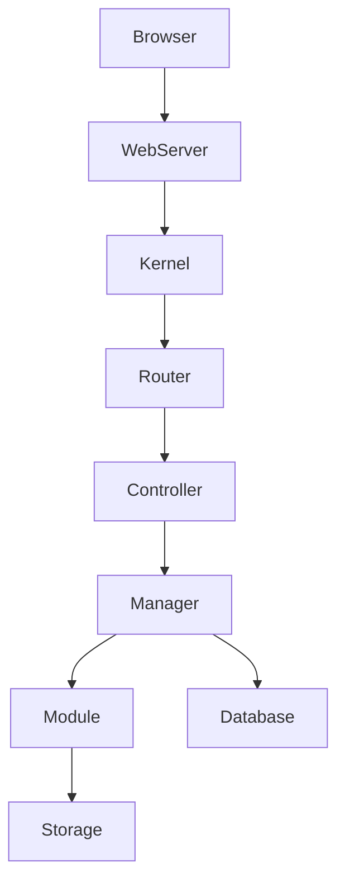

# Architektur — Komponenten & Laufzeit

Chamy ist in mehrere Schichten gegliedert:

- `core/` — Kernel, Bootstrap und Manager‑Klassen (ModuleManager, AssetLibraryManager, PermissionManager, usw.).
- `modules/` — Feature‑Module, jedes Modul kapselt Routen, Controller, Templates und migrations.
- `themes/` — Admin und Frontend Twig Templates, Asset‑Pipelines.
- `storage/` — Laufzeitdaten: `cache`, `logs`, `secrets`, `assets`.

Kernelemente

1) Kernel & Bootstrap
- Verantwortung: Anwendungskonfiguration, Service‑Container, Boot‑Sequenz.

2) ModuleManager
- Erkennt installierte Module, aktiviert/deaktiviert sie und lädt deren Hooks/Routes.

3) Manager‑Layer
- Beispiel: `AssetLibraryManager` (Google Fonts, Font‑Installation), `PermissionManager` (define + grant), `ThemeManager` (theme discovery/activation).

4) Data Provider
- Abstraktion für Live vs Mock DataProvider zur Trennung DB‑Logik.

Request‑Flow (vereinfachte Reihenfolge):
```
Client → Webserver → public/index.php → Kernel → Router → Controller → Manager/Module → Twig/Response
```

Diagram (Mermaid):



Weitere Details zu einzelnen Komponenten findest du in den Modul‑Seiten und im Developer Guide.

